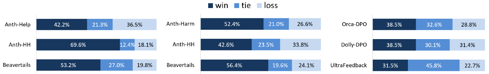

# Less for More: Enhancing Preference Learning in Generative Language Models with Automated Self-Curation of Training Corpora


----

We propose a simple yet effective Self-Curation method for training data that enhances preference learning by leveraging in-distribution trained proxy models.


<p align='center'>

<div align="center"><b>The proposed self-curation method </b></div>
</p>

<details>
<summary>Comparing Direct Preference Optimization (DPO) with Self-Curation to DPO without curation</summary>

<p align='center'>

<div align="center"><b>DPO with Self-Curation significantly and consistently surpasses DPO without curation</b></div>
</p>
</details>

## Citation
```
TBA
```
