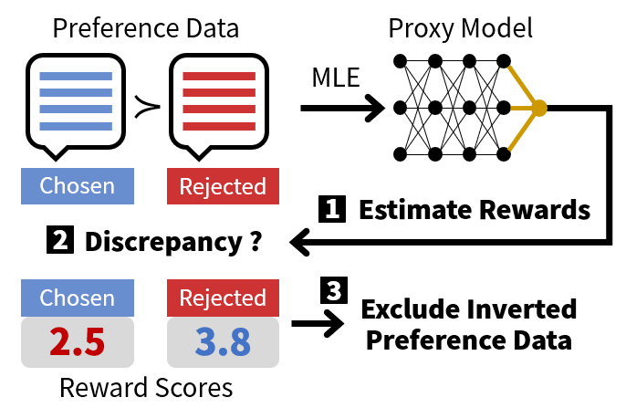

# Less for More: Enhancing Preference Learning in Generative Language Models with Automated Self-Curation of Training Corpora


----

We propose a novel Self-Curation method of training data that enhances preference learning by leveraging in-distribution trained proxy models.


<details>
<summary>Curriculum Learning</summary>

<p align='center'>

<div align="center"><b>The proposed self-curation method </b></div>
</p>
</details>

## Citation
```
TBA
```
